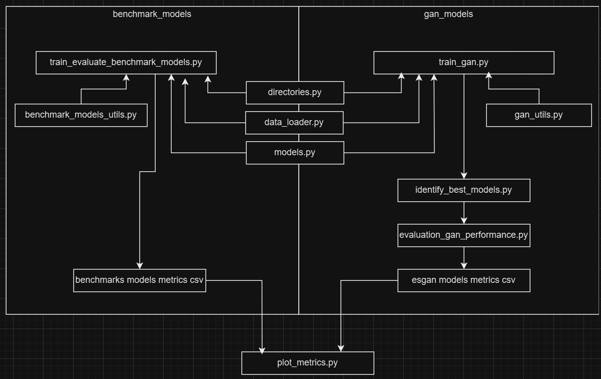

Example implementation and set up in Windows 11 OS

  https://docs.conda.io/projects/miniconda/en/latest/
  
  miniconda will be enough for creating venv and dependencies
  
  During the installation, you might be prompted to add Anaconda to the system PATH. If not, and if you encounter issues, you can add it         manually:
  
  check "Add Anaconda to my PATH environment variable" during installation.
  
  On Linux you may need to add the following line to your shell profile file (e.g., .bashrc or .zshrc):

Build local Conda virtual environment and dependencies
```
  conda create -n gan python=3.9   

  conda activate gan

  conda install -c conda-forge cudatoolkit=11.2 cudnn=8.1.0

  python -m pip install tensorflow==2.10

  pip install -r requirements.txt       
  
```
This was the last version of Tensorflow in native Windows that supports GPU, otherwise it should be implemented in WSL Linux node or native Linux OS.

The following workflow describes how py files are structured to implement the manuscript analysis.




1) Download data from Illinois Data Bank repository (https://doi.org/10.13012/B2IDB-8462244_V2) and place IMG folder and ground_truth.csv accordingly.
  
2) Execute the analysis via command line in the local conda env created above

```

python train_evaluate_benchmarks_models.py

python train_gan.py

python plot_metrics.py
